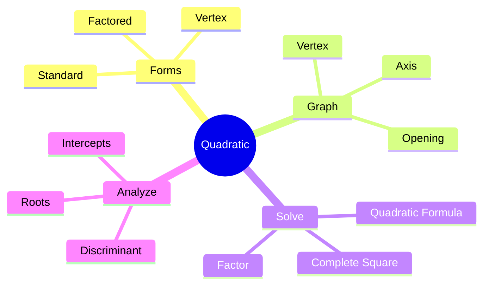

## What is a Quadratic Function?

Standard form: $f(x) = ax^2 + bx + c,\; a \ne 0$

Key shape: a parabola that opens up (a > 0) or down (a < 0).

---

## Vertex Form and Axis

Vertex form: $f(x) = a(x - h)^2 + k$

- Vertex: $(h, k)$
- Axis of symmetry: $x = h$
- Relation to standard form: $h = -\frac{b}{2a}$, $k = f(h)$

---

## Discriminant and Roots

Discriminant: $\Delta = b^2 - 4ac$

| $\Delta$ | Roots | Intersection with x-axis |
|---|---|---|
| $> 0$ | two real | two points |
| $= 0$ | one real (double) | tangent |
| $< 0$ | complex | none |

---

## Mind Map: Quadratic Toolbox



---

## Quadratic Formula (Code)

Formula: $x = \frac{-b \pm \sqrt{b^2 - 4ac}}{2a}$

```python
import math

def solve_quadratic(a, b, c):
    disc = b * b - 4 * a * c
    if disc < 0:
        return []
    sqrt_disc = math.sqrt(disc)
    return [(-b - sqrt_disc) / (2 * a), (-b + sqrt_disc) / (2 * a)]

print(solve_quadratic(1, -3, 2))  # [1.0, 2.0]
```
